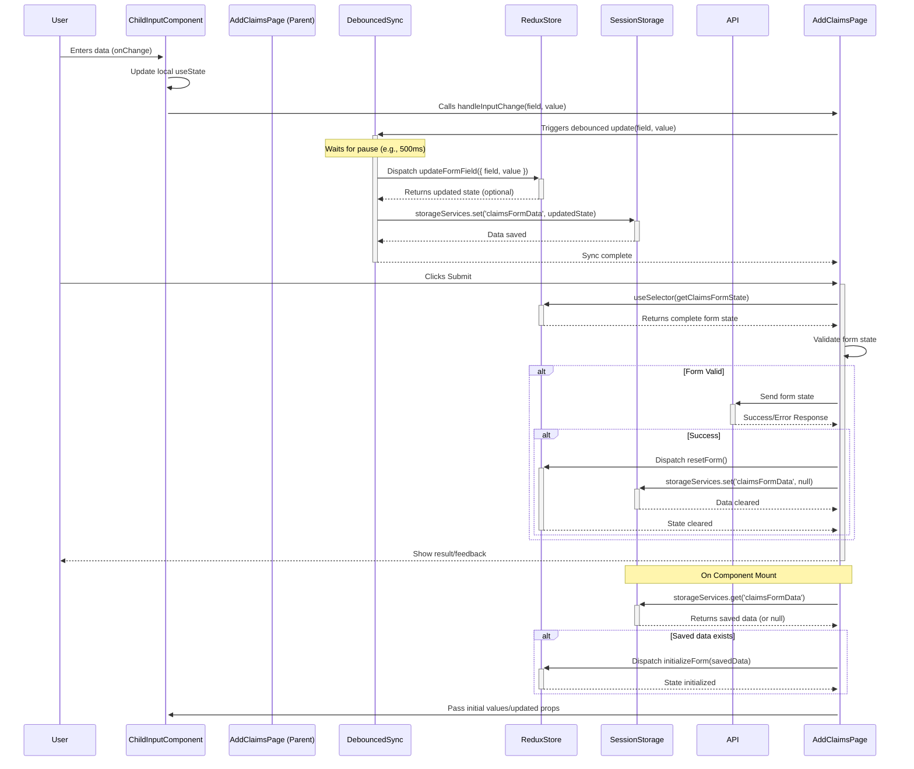

# Add Claims Form State Management Architecture

## 1. Goal

Create a robust system for managing the state of a multi-component "Add Claims" form, ensuring data persistence across page refreshes (within a session) and maintaining a central state representation in Redux.

## 2. Proposed Architecture

- **Component Structure:**
  - `src/pages/AddClaims.tsx`: The parent component that orchestrates the form. It will manage the overall form state synchronization logic.
  - Child Components (e.g., `ClaimDetailsForm.tsx`, `PolicyholderInfoForm.tsx`): Each component will manage its own input fields using local `useState` hooks for immediate UI feedback. They will receive initial values and an update handler function (`handleInputChange`) as props from `AddClaims.tsx`.
- **Redux:**
  - Create a new Redux slice: `src/redux/slices/claimsFormSlice/claimsFormSlice.ts`.
  - This slice will hold the entire state object for the claims form (e.g., `{ claimDetails: {...}, policyholderInfo: {...} }`).
  - Define reducers/actions:
    - `initializeForm(state, action)`: To load data from `sessionStorage` on mount.
    - `updateFormField(state, action)`: To update a specific field in the form state.
    - `resetForm(state)`: To clear the form state (e.g., after successful submission).
  - Register this new slice in `src/redux/index.ts`.
- **Session Storage:**
  - Use `src/utility/storageServices.ts` to save and retrieve the _entire_ claims form state object under a specific key (e.g., `'claimsFormData'`).
- **Synchronization Logic (within `AddClaims.tsx` or a custom hook):**
  - **Initialization (`useEffect` on mount):**
    1.  Attempt to load `'claimsFormData'` from `sessionStorage` using `storageServices.get`.
    2.  If data exists, dispatch `initializeForm` action to Redux with the loaded data.
    3.  If no data exists, ensure Redux has the default initial state.
  - **Input Handling:**
    1.  Child components update their local `useState` on every keystroke (`onChange`).
    2.  They call the `handleInputChange(fieldName, value)` prop passed from `AddClaims.tsx`.
  - **Debounced Sync (`handleInputChange` in `AddClaims.tsx`):**
    1.  Use a debounced function (e.g., via `lodash.debounce` or a simple `setTimeout` approach) wrapping the actual sync logic. This prevents excessive updates on every keystroke. A delay of 300-500ms is usually good.
    2.  Inside the debounced function:
        - Dispatch the `updateFormField` action to Redux with the `fieldName` and `value`.
        - Get the _latest_ complete form state from Redux (using `store.getState()` or passing the updated state from the reducer if using thunks).
        - Save the _entire updated form state object_ to `sessionStorage` using `storageServices.set`.
  - **Submission:**
    1.  Read the complete, validated form state directly from the Redux store using `useSelector`.
    2.  Use this data for the API call.
    3.  On success, optionally dispatch `resetForm` and clear `sessionStorage`.

## 3. Data Flow Diagram

## 4. When to Sync

- **Sync Local State -> Redux & SessionStorage:** After user input, but debounced (e.g., on pause typing or field blur). This keeps the central stores updated without overwhelming the system on every keystroke.
- **Sync SessionStorage -> Redux:** On component mount. This restores the user's progress if they refresh the page or navigate away and back within the same session.
- **Use Redux State -> API:** On form submission. Redux holds the complete, validated state ready for the API call.

## 5. Rationale

- **Local State:** Provides the most responsive UI for inputs.
- **SessionStorage:** Handles persistence across page refreshes within a session.
- **Redux:** Acts as the single source of truth for the application's current state, simplifies data access for submission, and integrates well with Redux DevTools for debugging.
- **Debouncing:** Optimizes performance by reducing the frequency of Redux and `sessionStorage` updates.
